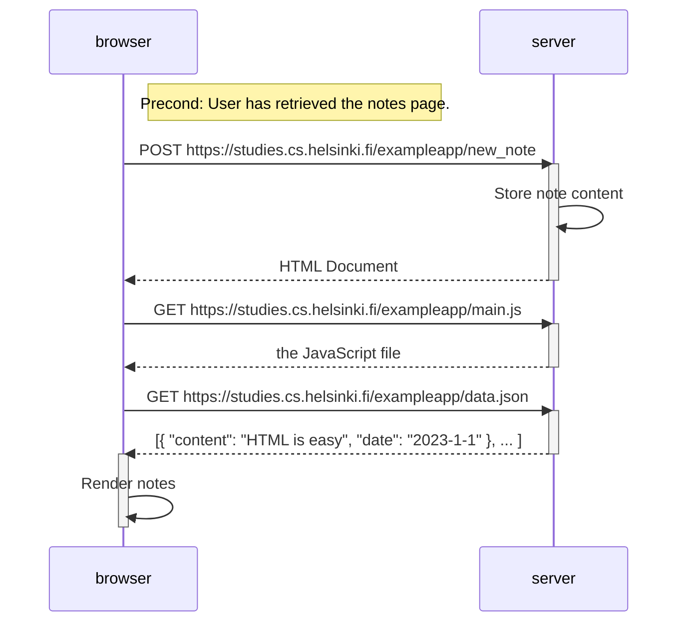

## Author
Kenneth Ulloa

```mermaid
sequenceDiagram
    participant browser
    participant server

    Note right of browser: Precond: User has retrieved the notes page.

    browser->>server: POST https://studies.cs.helsinki.fi/exampleapp/new_note 
    activate server
    server->>server: Store note content
    server-->>browser: HTML Document
    deactivate server

    browser->>server: GET https://studies.cs.helsinki.fi/exampleapp/main.js
    activate server
    server-->>browser: the JavaScript file
    deactivate server
     browser->>server: GET https://studies.cs.helsinki.fi/exampleapp/data.json
    activate server
    server-->>browser: [{ "content": "HTML is easy", "date": "2023-1-1" }, ... ]
    deactivate server
    activate browser
    browser->>browser: Render notes
    deactivate browser

```

