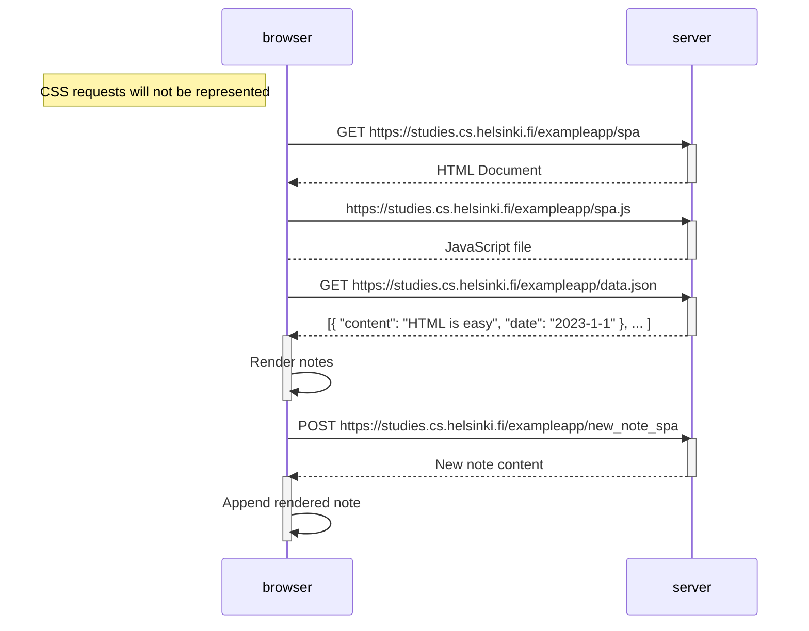

```mermaid
sequenceDiagram
    participant browser
    participant server

    Note left of browser: CSS requests will not be represented
    browser->>server: GET https://studies.cs.helsinki.fi/exampleapp/spa
    activate server
    server-->>browser: HTML Document
    deactivate server
    browser->>server: https://studies.cs.helsinki.fi/exampleapp/spa.js
    activate server
    server-->browser: JavaScript file
    deactivate server
    browser->>server: GET https://studies.cs.helsinki.fi/exampleapp/data.json
    activate server
    server-->>browser: [{ "content": "HTML is easy", "date": "2023-1-1" }, ... ]
    deactivate server
    activate browser
    browser->>browser: Render notes
    deactivate browser
    
    browser->>server: POST https://studies.cs.helsinki.fi/exampleapp/new_note_spa
    activate server
    server-->>browser: New note content
    deactivate server
    activate browser
    browser->>browser: Append rendered note
    deactivate browser
```